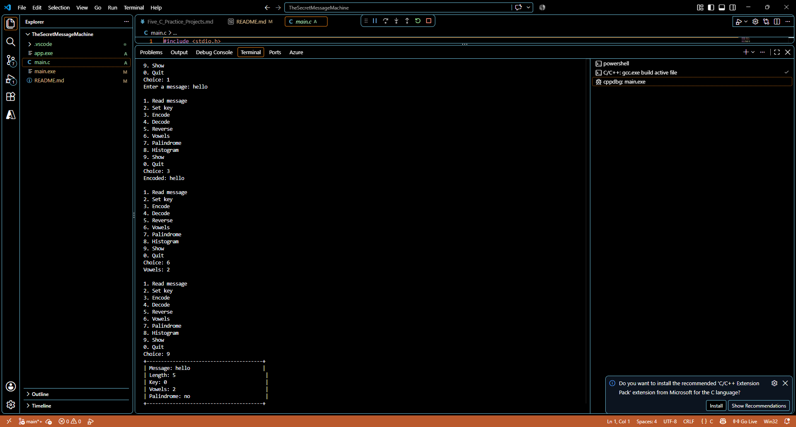

## name : Tasneem Hossam El-Din Hassan Salem
## email : tasneem.hossameldin@outlook.com


# Project 5: The Secret Message Machine

## Build

From this folder, run:

```text
gcc -std=c99 -Wall -Wextra -o app main.c
```

Run the program with `app` on Windows.

## What it does

The program stores a message up to 127 characters, applies a Caesar shift from 0 through 25, decodes shifted text, reverses text in place, counts vowels, checks for palindromes while ignoring spaces and letter case, and prints a letter histogram.

## Explain why

Decoding with key `k` uses `26 - k` because the alphabet has 26 positions. Moving forward `k` positions and then forward `26 - k` positions makes a complete turn around the alphabet, returning every letter to its original position. Key 0 and key 26 therefore leave text unchanged.



